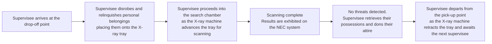

```mermaid
flowchart LR
    A[Supervisee arrives at the drop-off point]
    B[Supervisee disrobes and relinquishes personal belongings<br/>placing them onto the X-ray tray]
    C[Supervisee proceeds into the search chamber<br/>as the X-ray machine advances the tray for scanning]
    D[Scanning complete<br/>Results are exhibited on the NEC system]
    E[No threats detected.<br/>Supervisee retrieves their possessions and dons their attire]
    F[Supervisee departs from the pick-up point<br/>as the X-ray machine retracts the tray and awaits the next supervisee]

    A --> B
    B --> C
    C --> D
    D --> E
    E --> F
```
